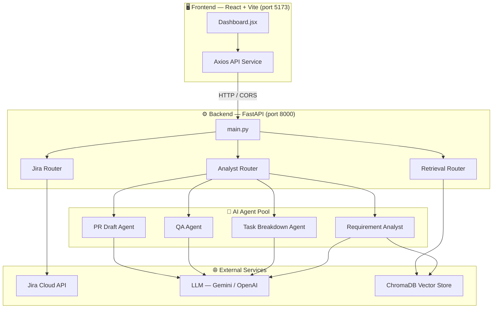
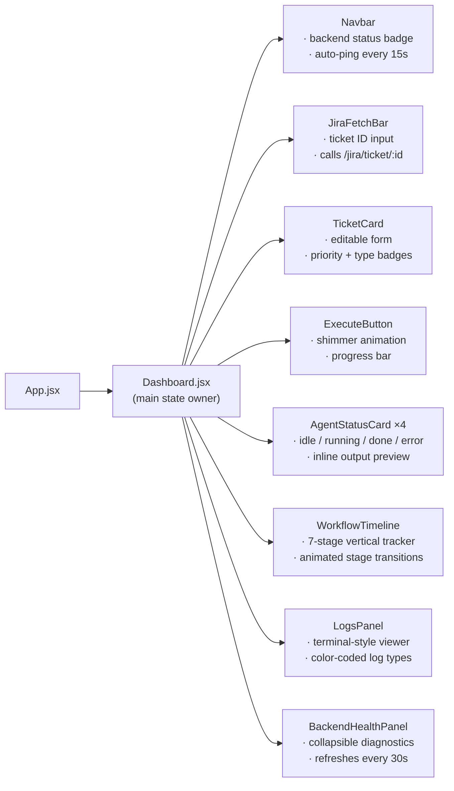
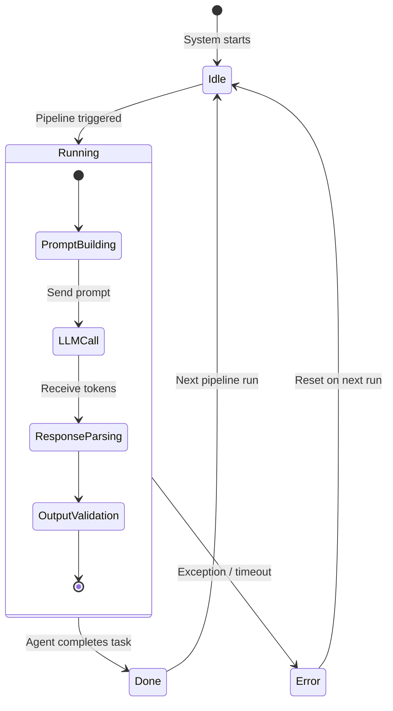
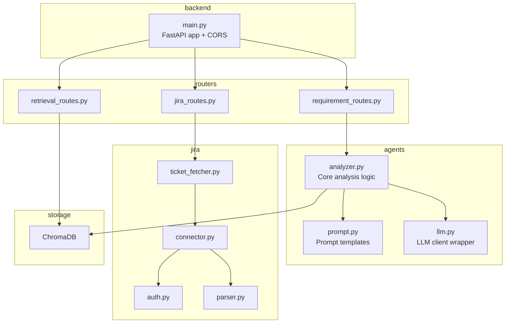

# Jira Agentic Development System

A multi-agent AI platform that takes a Jira ticket and autonomously handles the full software development lifecycle — from parsing requirements all the way through code generation, testing, and pull request drafting. Powered by LLM-based agents orchestrated through LangGraph, with a React dashboard that makes the entire pipeline visible in real time.

> Built for a hackathon to demonstrate what autonomous AI-driven development actually looks like in practice.

---

## What It Does

You provide a Jira ticket — a title, description, priority, and type. The system passes it through a chain of specialized AI agents, each responsible for a distinct part of the development process. Every agent reasons through its task, produces structured output, and hands off to the next. The frontend dashboard visualizes all of this live.

---

## Architecture Diagrams

### 1. High-Level System Architecture



---

### 2. Multi-Agent Pipeline — Sequence Flow

```mermaid
sequenceDiagram
    actor User
    participant Dashboard as React Dashboard
    participant API as Axios API Service
    participant Backend as FastAPI Backend
    participant RA as Requirement Analyst
    participant TBA as Task Breakdown Agent
    participant QA as QA Agent
    participant PR as PR Draft Agent
    participant LLM as LLM Provider

    User->>Dashboard: Fill ticket form & click Execute Pipeline
    Dashboard->>API: POST /execute-ticket/{ticket_id}
    API->>Backend: HTTP Request

    rect rgb(20, 40, 70)
        note over Backend,RA: Stage 1 — Requirement Analysis
        Backend->>RA: Dispatch ticket payload
        RA->>LLM: Prompt: analyze requirements
        LLM-->>RA: 7-section structured analysis
        RA-->>Backend: requirements{}
        Backend-->>API: Partial result
        API-->>Dashboard: AgentStatusCard RA → done
    end

    rect rgb(20, 60, 40)
        note over Backend,TBA: Stage 2 — Engineering Task Breakdown
        Backend->>TBA: Dispatch requirements
        TBA->>LLM: Prompt: break into TASK-N items
        LLM-->>TBA: tasks[], estimates
        TBA-->>Backend: tasks[]
        Backend-->>API: Partial result
        API-->>Dashboard: AgentStatusCard TBA → done
    end

    rect rgb(60, 20, 40)
        note over Backend,QA: Stage 3 — Edge Cases & Security
        Backend->>QA: Dispatch requirements + tasks
        QA->>LLM: Prompt: identify risks & edge cases
        LLM-->>QA: edge_cases[], risks[]
        QA-->>Backend: edge_cases[]
        Backend-->>API: Partial result
        API-->>Dashboard: AgentStatusCard QA → done
    end

    rect rgb(50, 35, 65)
        note over Backend,PR: Stage 4 — Reasoning Trace
        Backend->>PR: Dispatch full context
        PR->>LLM: Prompt: generate chain-of-thought
        LLM-->>PR: reasoning_steps[]
        PR-->>Backend: reasoning[]
        Backend-->>API: Final aggregated result
        API-->>Dashboard: All result sections updated
    end

    Dashboard-->>User: Render WorkflowTimeline, LogsPanel, Results
```



---

### 3. Frontend Component Architecture



---

### 4. Agent State Machine



---

### 5. Backend Module Dependency Map



---

## Project Structure

```
Jira-Agentic-Development-System/
├── backend/
│   ├── main.py                    # FastAPI app, CORS config, router registration
│   └── jira/
│       ├── auth.py                # Jira authentication
│       ├── connector.py           # Jira API client
│       ├── jira_routes.py         # FastAPI routes for Jira operations
│       ├── parser.py              # Ticket data parsing and normalization
│       └── ticket_fetcher.py      # Fetches tickets by ID from Jira
│
├── agents/
│   ├── llm.py                     # LLM client wrapper and model configuration
│   └── requirement_analyst/
│       ├── __init__.py
│       ├── analyzer.py            # Core analysis logic and result model
│       ├── prompt.py              # Prompt templates for all analysis modes
│       └── requirement_routes.py  # FastAPI routes for the analyst agent
│
├── vectorstore/
│   └── retrieval_routes.py        # RAG retrieval endpoints using ChromaDB
│
├── tests/
│   ├── test_requirement_analyst.py
│   ├── test_jira_connector.py
│   ├── test_e2e_workflow.py
│   └── ...
│
├── frontend/                      # React dashboard (see frontend/README.md)
│   └── src/
│       ├── components/            # 8 UI components
│       ├── pages/                 # Dashboard page
│       └── services/api.js        # Axios API layer
│
├── requirements.txt
└── README.md
```

---

## Backend Setup

### Prerequisites

- Python 3.10 or later
- A Jira account with API token access
- An LLM API key (OpenAI or compatible provider)
- ChromaDB (used for the vector store / RAG retrieval)

### Installation

```bash
git clone https://github.com/your-org/Jira-Agentic-Development-System.git
cd Jira-Agentic-Development-System
pip install -r requirements.txt
```

### Environment Variables

Create a `.env` file at the project root:

```
JIRA_BASE_URL=https://your-org.atlassian.net
JIRA_EMAIL=your-email@example.com
JIRA_API_TOKEN=your-jira-api-token

OPENAI_API_KEY=your-openai-api-key

CHROMA_PERSIST_DIR=./vectorstore/chroma_db
```

### Running the Backend

```bash
uvicorn backend.main:app --reload --port 8000
```

API docs available at `http://127.0.0.1:8000/docs`

---

## Frontend Setup

```bash
cd frontend
npm install
npm run dev
```

Open `http://localhost:5173`. The dashboard auto-detects the backend — if it's not running, it falls back to a full demo simulation.

---

## API Reference

### Health & Status

| Method | Path | Description |
|---|---|---|
| GET | `/` | Root health check |
| GET | `/health` | Service health status |
| GET | `/agents/status` | Status of all agents in the pool |

### Workflow

| Method | Path | Description |
|---|---|---|
| POST | `/execute-ticket/{ticket_id}` | Triggers the full multi-agent pipeline |

### Requirement Analyst

| Method | Path | Description |
|---|---|---|
| POST | `/analyst/analyze` | Full 7-section requirement analysis |
| POST | `/analyst/analyze-ticket` | Fetch from Jira by ID then analyze |
| POST | `/analyst/engineering-tasks` | Break ticket into atomic TASK-N items |
| POST | `/analyst/edge-cases` | Identify edge cases and security risks |
| POST | `/analyst/reasoning` | Generate chain-of-thought reasoning trace |
| GET | `/analyst/health` | Analyst health, model name, retriever status |

### Jira & Vector Store

| Method | Path | Description |
|---|---|---|
| GET | `/jira/ticket/{ticket_id}` | Fetch a Jira ticket by ID |
| POST | `/retrieval/search` | Semantic search over the indexed codebase |

---

## Running Tests

```bash
pytest tests/
pytest tests/test_e2e_workflow.py -v
```

---

## Known Limitations

- The Developer Agent and PR Generator endpoints are currently stubs. The pipeline simulation uses demo data for code generation and PR drafting.
- The vector store requires initial indexing before the retriever can function.
- The system assumes a single Jira project.

---

## License

Built for a hackathon. Open for extension and adaptation.
