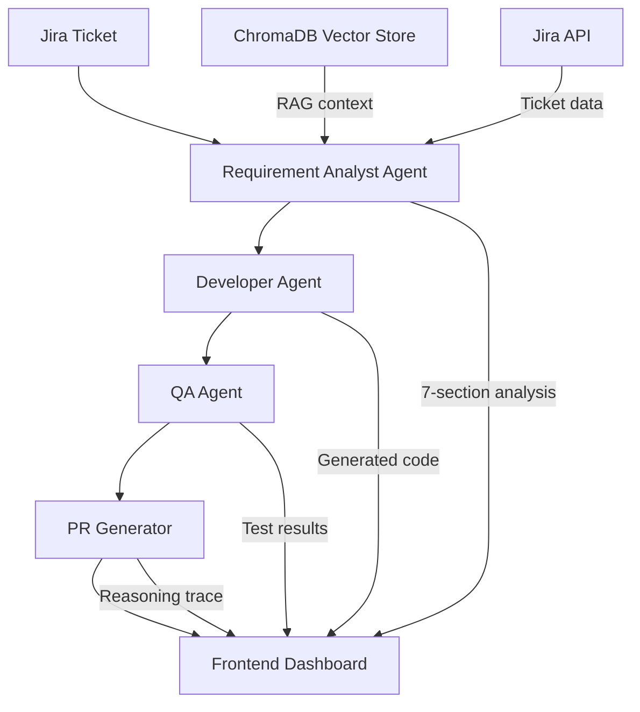
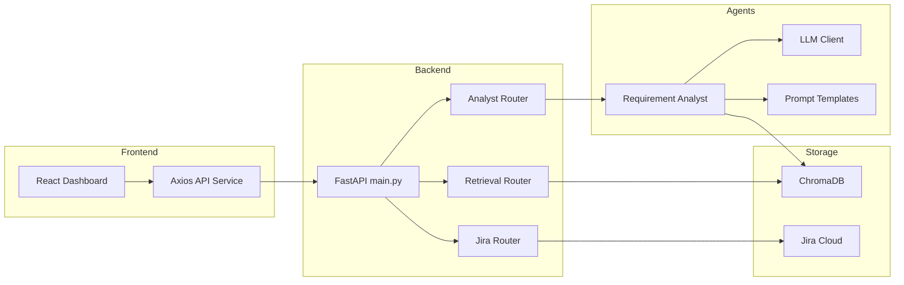
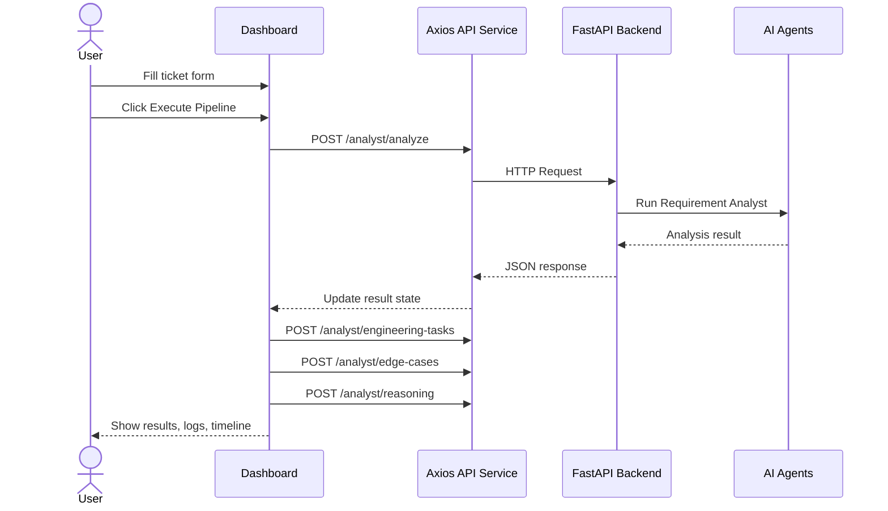

# Jira Agentic Development System

A multi-agent AI platform that takes a Jira ticket and autonomously handles the full software development lifecycle — from parsing requirements all the way through code generation, testing, and pull request drafting. The system is powered by LLM-based agents orchestrated through LangGraph, with a React dashboard that makes the entire pipeline visible in real time.

This project was built for a hackathon to demonstrate what autonomous AI-driven development actually looks like in practice, not just in theory.

---

## What It Does

You provide a Jira ticket — a title, description, priority, and type. The system then passes it through a chain of specialized AI agents, each responsible for a distinct part of the development process. Every agent reasons through its task, produces structured output, and hands off to the next.

The frontend dashboard visualizes all of this live. You can watch each agent's status change, read the reasoning behind decisions, review the generated code, and see QA results — all in one place.

---

## System Architecture

The system is split into two layers: a FastAPI backend that orchestrates the AI agents, and a React frontend that visualizes the pipeline in real time.



---

## Component Architecture

The diagram below shows how the backend modules relate to each other and how the frontend connects through the API layer.



---

## Project Structure

```
Jira-Agentic-Development-System/
|
├── backend/
|   ├── main.py                    # FastAPI app, CORS config, router registration
|   └── jira/
|       ├── auth.py                # Jira authentication
|       ├── connector.py           # Jira API client
|       ├── jira_routes.py         # FastAPI routes for Jira operations
|       ├── parser.py              # Ticket data parsing and normalization
|       └── ticket_fetcher.py      # Fetches tickets by ID from Jira
|
├── agents/
|   ├── llm.py                     # LLM client wrapper and model configuration
|   └── requirement_analyst/
|       ├── __init__.py
|       ├── analyzer.py            # Core analysis logic and result model
|       ├── prompt.py              # Prompt templates for all analysis modes
|       └── requirement_routes.py  # FastAPI routes for the analyst agent
|
├── vectorstore/
|   └── retrieval_routes.py        # RAG retrieval endpoints using ChromaDB
|
├── tests/
|   ├── test_requirement_analyst.py
|   ├── test_jira_connector.py
|   ├── test_llm.py
|   ├── test_vectorstore.py
|   ├── test_retriever.py
|   ├── test_embeddings_chroma.py
|   ├── test_e2e_workflow.py
|   ├── test_chunker_phase.py
|   ├── test_parser_full.py
|   ├── test_ticket_fetcher_full.py
|   ├── test_advanced_prompts.py
|   ├── test_ai_format.py
|   └── test_reliability.py
|
├── frontend/                      # React dashboard (see frontend/README.md)
|   ├── src/
|   |   ├── components/            # 8 UI components
|   |   ├── pages/                 # Dashboard page
|   |   └── services/api.js        # Axios API layer
|   └── ...
|
├── requirements.txt
└── README.md
```

---

## Backend Setup

### Prerequisites

- Python 3.10 or later
- A Jira account with API token access
- An LLM API key (OpenAI or compatible provider)
- ChromaDB (used for the vector store / RAG retrieval)

### Installation

Clone the repository and install dependencies:

```bash
git clone https://github.com/your-org/Jira-Agentic-Development-System.git
cd Jira-Agentic-Development-System
pip install -r requirements.txt
```

### Environment Variables

Create a `.env` file at the project root with the following values:

```
JIRA_BASE_URL=https://your-org.atlassian.net
JIRA_EMAIL=your-email@example.com
JIRA_API_TOKEN=your-jira-api-token

OPENAI_API_KEY=your-openai-api-key

CHROMA_PERSIST_DIR=./vectorstore/chroma_db
```

### Running the Backend

```bash
uvicorn backend.main:app --reload --port 8000
```

The API will be available at `http://127.0.0.1:8000`.

Interactive API documentation is available at:
- Swagger UI: `http://127.0.0.1:8000/docs`
- ReDoc: `http://127.0.0.1:8000/redoc`

---

## Frontend Setup

### Prerequisites

- Node.js 18 or later
- npm

### Installation

```bash
cd frontend
npm install
```

### Running the Dashboard

```bash
npm run dev
```

Open `http://localhost:5173` in your browser.

The dashboard automatically detects whether the backend is running. If it is, it connects and calls real endpoints. If not, it falls back to a demo simulation so you can still see the full UI and pipeline animation.

---

## API Reference

### Health and Status

| Method | Path | Description |
|---|---|---|
| GET | `/` | Root health check |
| GET | `/health` | Service health status |
| GET | `/agents/status` | Status of all agents in the pool |

### Workflow

| Method | Path | Description |
|---|---|---|
| POST | `/execute-ticket/{ticket_id}` | Triggers the full multi-agent pipeline for a given ticket |

### Requirement Analyst Agent

| Method | Path | Description |
|---|---|---|
| POST | `/analyst/analyze` | Full 7-section requirement analysis from ticket data |
| POST | `/analyst/analyze-ticket` | Fetches ticket from Jira by ID, then runs full analysis |
| POST | `/analyst/engineering-tasks` | Breaks ticket into atomic TASK-N engineering items |
| POST | `/analyst/edge-cases` | Identifies edge cases and security risks |
| POST | `/analyst/reasoning` | Generates an explainable chain-of-thought reasoning trace |
| GET | `/analyst/health` | Returns analyst agent health, model name, and retriever status |

### Jira

| Method | Path | Description |
|---|---|---|
| GET | `/jira/ticket/{ticket_id}` | Fetch a Jira ticket by ID |

### Vector Store

| Method | Path | Description |
|---|---|---|
| POST | `/retrieval/search` | Semantic search over the indexed codebase |

---

## How the Requirement Analyst Works

The analyst agent is the first and most detailed agent in the pipeline. When it receives a ticket, it produces a structured analysis across seven sections:

1. **Summary** — A concise restatement of the requirement
2. **Functional Requirements** — What the system must do, expressed as FR-N items
3. **Technical Requirements** — Infrastructure and implementation constraints
4. **Affected Files** — Which parts of the codebase need to change
5. **Implementation Steps** — Ordered plan for building the feature
6. **Ambiguities** — Unclear or underspecified parts of the ticket
7. **Risk Assessment** — Security, performance, and regression risks

It also supports two alternative modes: engineering task breakdown (produces atomic TASK-N items) and edge case analysis (security risks, failure modes, mitigations).

The analyst uses a RAG retriever backed by ChromaDB to ground its analysis in the actual codebase rather than generating generic responses.

---

## Running Tests

All tests live in the `tests/` directory and use pytest.

```bash
# Run all tests
pytest tests/

# Run a specific test file
pytest tests/test_requirement_analyst.py -v

# Run end-to-end workflow test
pytest tests/test_e2e_workflow.py -v
```

The test suite covers the LLM client, Jira connector, ticket parser, vector store, embeddings, retriever, prompt formatting, and the full end-to-end workflow.

---

## Frontend at a Glance

The dashboard has eight components working together. The data flow from user action through to displayed results follows this path:



Component overview:

- **Navbar** — Shows backend connection status updated every 15 seconds
- **JiraFetchBar** — Enter a ticket ID to pull real data from Jira into the form
- **TicketCard** — Editable form for all ticket fields with priority badges
- **ExecuteButton** — Starts the pipeline with a shimmer animation and progress bar
- **AgentStatusCard** — One card per agent, showing idle / running / done / error state
- **WorkflowTimeline** — Seven-stage animated vertical timeline with timestamps
- **LogsPanel** — Terminal-style viewer for real-time log output
- **BackendHealthPanel** — Collapsible panel showing LLM model, retriever health, and active endpoints

All result sections include a copy-to-clipboard button for quick use during a demo.

---

## Git Workflow

The project follows a feature branch workflow.

```bash
# Always pull before starting
git pull origin main

# Create a branch for your feature
git checkout -b feature/your-feature-name

# After your work is done
git add .
git commit -m "Brief description of what changed"
git push origin feature/your-feature-name
```

Frontend work was developed on the `frontend-dashboard` branch.

---

## Known Limitations

- The Developer Agent and PR Generator endpoints are currently stubs. The pipeline simulation uses demo data for code generation and PR drafting. These agents are designed to be wired in as the backend evolves.
- The vector store requires initial indexing before the retriever can function. If the retriever shows as not ready in the health panel, the analyst will still run but without codebase context.
- The system assumes a single Jira project. Multi-project support would require extending the Jira connector.

---

## License

Built for a hackathon. Open for extension and adaptation.
