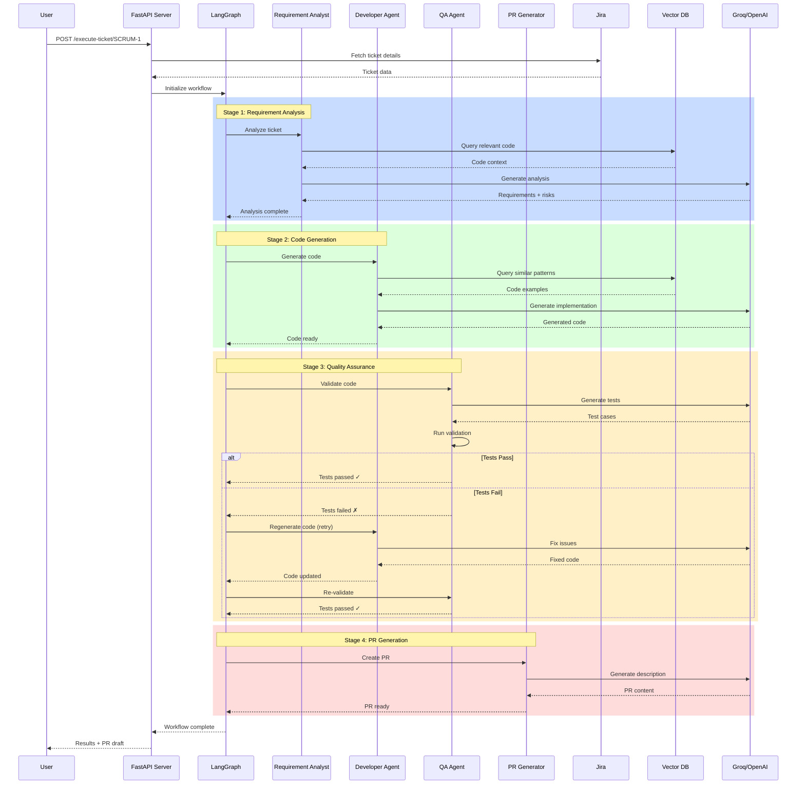
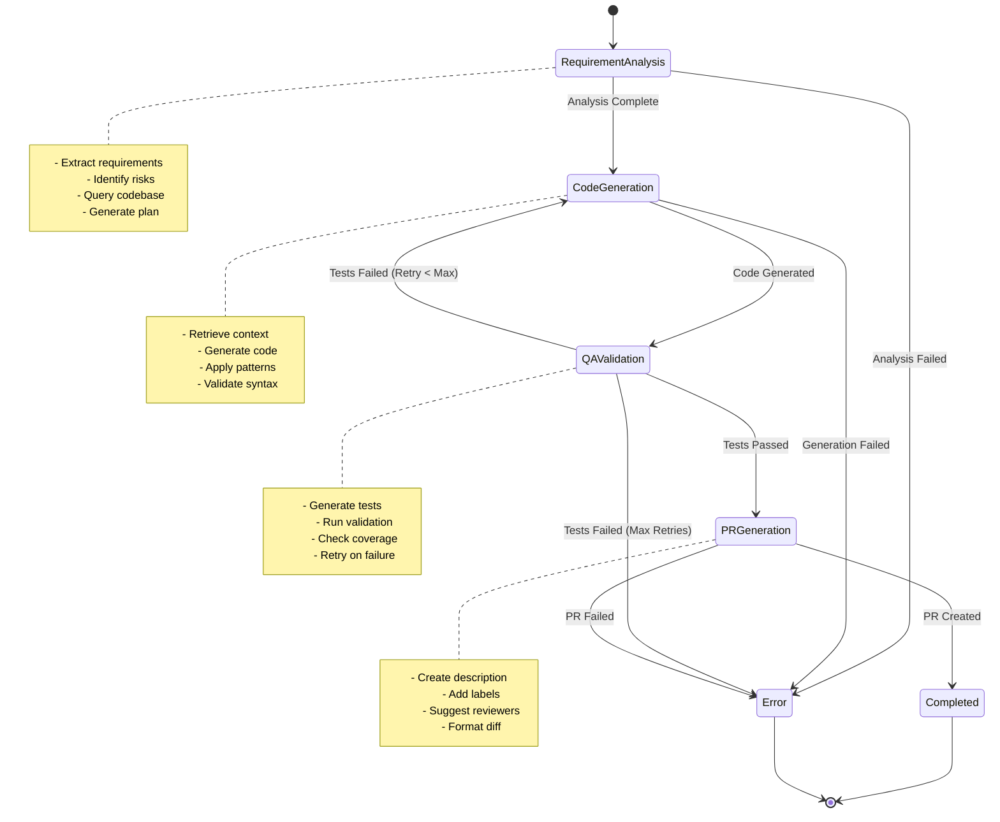
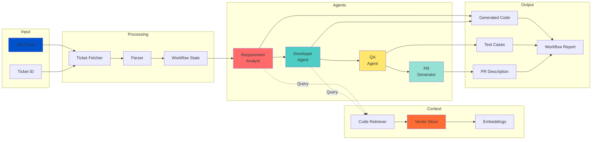
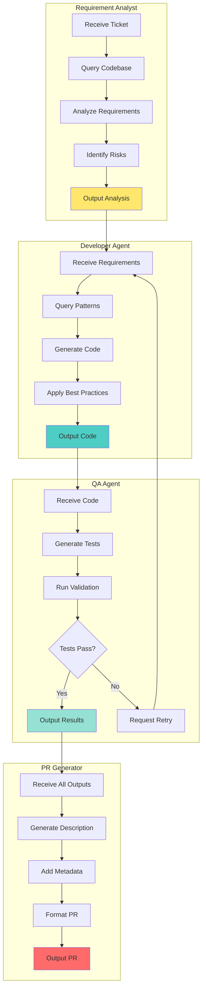
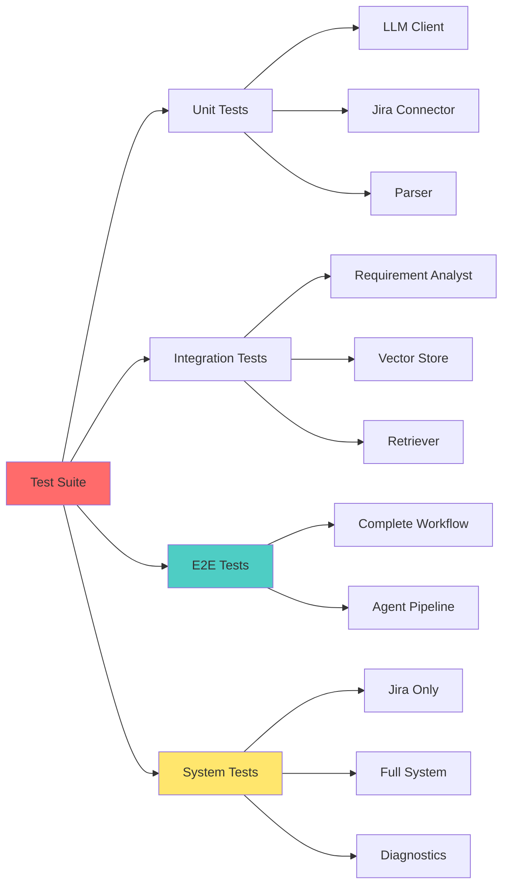

# 🤖 Jira Agentic Development System

[](https://www.python.org/downloads/)
[](https://fastapi.tiangolo.com/)
[](https://github.com/langchain-ai/langgraph)
[](LICENSE)

A **multi-agent AI platform** that autonomously handles the complete software development lifecycle — from Jira ticket analysis through code generation, testing, and pull request creation. Powered by LLM-based agents orchestrated through **LangGraph**, with real-time visualization and intelligent retry logic.

> 🎯 **Built to demonstrate autonomous AI-driven development in practice, not just theory.**

---

## 📋 Table of Contents

- [Overview](#-overview)
- [Key Features](#-key-features)
- [System Architecture](#-system-architecture)
- [Workflow Diagrams](#-workflow-diagrams)
- [Quick Start](#-quick-start)
- [Project Structure](#-project-structure)
- [API Reference](#-api-reference)
- [Testing](#-testing)
- [Configuration](#-configuration)
- [Troubleshooting](#-troubleshooting)

---

## 🎯 Overview

### What It Does

Transform a Jira ticket into production-ready code through an autonomous multi-agent pipeline:

1. **📊 Requirement Analysis** - Extracts functional/technical requirements, identifies risks
2. **💻 Code Generation** - Creates repository-aware implementation code
3. **🧪 Quality Assurance** - Generates and validates comprehensive test cases
4. **📝 PR Creation** - Drafts pull requests with descriptions and summaries

### Why It Matters

- ⚡ **Accelerates Development** - Automates repetitive coding tasks
- 🎯 **Maintains Quality** - Built-in QA validation with retry logic
- 📈 **Scales Teams** - Handles multiple tickets concurrently
- 🔍 **Full Transparency** - Every decision is logged and explainable

---

## ✨ Key Features

### 🤖 Multi-Agent Architecture
- **4 Specialized Agents** - Each expert in their domain
- **LangGraph Orchestration** - Intelligent workflow management
- **Automatic Retry Logic** - Self-healing on QA failures
- **Parallel Processing** - Handle multiple tickets simultaneously

### 🔗 Jira Integration
- **Direct API Connection** - Fetch tickets in real-time
- **Bidirectional Sync** - Update ticket status automatically
- **JQL Support** - Advanced ticket filtering
- **Multi-Project** - Support for multiple Jira projects

### 🧠 RAG-Powered Intelligence
- **ChromaDB Vector Store** - Semantic code search
- **Repository Awareness** - Context-aware code generation
- **Smart Retrieval** - Only relevant code in context
- **Incremental Indexing** - Efficient codebase updates

### 📊 Real-Time Monitoring
- **Live Dashboard** - Watch agents work in real-time
- **Detailed Logging** - Complete audit trail
- **Health Checks** - Monitor system status
- **Progress Tracking** - Visual workflow timeline

---

## 🏗️ System Architecture

### High-Level Architecture

```mermaid
graph TB
    subgraph "External Systems"
        A[Jira Cloud]
        B[GitHub/GitLab]
    end
    
    subgraph "Frontend Layer"
        C[React Dashboard]
        D[Real-time WebSocket]
    end
    
    subgraph "API Layer"
        E[FastAPI Server]
        F[REST Endpoints]
        G[CORS Middleware]
    end
    
    subgraph "Agent Layer"
        H[Requirement Analyst]
        I[Developer Agent]
        J[QA Agent]
        K[PR Generator]
    end
    
    subgraph "Orchestration Layer"
        L[LangGraph Workflow]
        M[State Management]
        N[Retry Logic]
    end
    
    subgraph "Data Layer"
        O[ChromaDB Vector Store]
        P[Embeddings Engine]
        Q[Code Retriever]
    end
    
    subgraph "LLM Layer"
        R[Groq API]
        S[OpenAI Fallback]
    end
    
    A -->|Fetch Tickets| E
    C -->|API Calls| F
    F --> E
    E --> L
    L --> H
    H --> I
    I --> J
    J --> K
    K -->|Create PR| B
    
    H -.->|Query Context| Q
    I -.->|Query Context| Q
    Q --> O
    O --> P
    
    H -.->|LLM Calls| R
    I -.->|LLM Calls| R
    J -.->|LLM Calls| R
    K -.->|LLM Calls| R
    R -.->|Fallback| S
    
    L --> M
    L --> N
    N -.->|Retry| J
    
    style A fill:#0052CC
    style B fill:#181717
    style C fill:#61DAFB
    style L fill:#FF6B6B
    style O fill:#FF6B35
    style R fill:#FF6B6B
```



---

## 🔄 Workflow Diagrams

### Complete Agent Workflow



### LangGraph State Machine



### Data Flow Architecture



### Agent Communication Pattern



---

## 🚀 Quick Start

### Prerequisites

- **Python 3.10+**
- **Node.js 18+** (for frontend)
- **Jira Account** with API token
- **Groq API Key** (or OpenAI)

### 1. Clone Repository

```bash
git clone https://github.com/your-org/Jira-Agentic-Development-System.git
cd Jira-Agentic-Development-System
```

### 2. Backend Setup

```bash
# Install dependencies
pip install -r requirements.txt

# Create .env file
cat > .env << EOF
# LLM Configuration
GROQ_API_KEY=your_groq_api_key_here

# Jira Configuration
JIRA_BASE_URL=https://your-domain.atlassian.net
JIRA_EMAIL=your-email@example.com
JIRA_API_KEY=your_jira_api_token
JIRA_PROJECT_KEY=YOUR_PROJECT

# Optional: GitHub Integration
GITHUB_TOKEN=your_github_token
EOF

# Run backend
python backend/main.py
```

Backend will be available at `http://localhost:8000`

### 3. Frontend Setup (Optional)

```bash
cd frontend
npm install
npm run dev
```

Dashboard will be available at `http://localhost:5173`

### 4. Test the System

```bash
# Quick Jira connectivity test (no LLM)
python test_jira_only.py

# Complete system test (with LLM)
python test_my_jira.py

# Run diagnostic
python fix_issues.py
```

### 5. Execute Your First Ticket

```bash
# Via API
curl -X POST "http://localhost:8000/execute-ticket/SCRUM-1"

# Or via Python
python -c "
from workflows.orchestrator.graph import execute_workflow
result = execute_workflow('SCRUM-1', max_retries=2, verbose=True)
print(result)
"
```

---

## 📁 Project Structure

```
Jira-Agentic-Development-System/
│
├── backend/
│   ├── main.py                    # FastAPI app entry point
│   ├── jira/
│   │   ├── auth.py                # Jira authentication
│   │   ├── connector.py           # Jira API client
│   │   ├── jira_routes.py         # Jira REST endpoints
│   │   ├── parser.py              # Ticket data parser
│   │   └── ticket_fetcher.py      # Ticket fetching logic
│   └── config/
│
├── agents/
│   ├── llm.py                     # LLM client with fallback
│   ├── requirement_analyst/
│   │   ├── analyzer.py            # Requirement analysis logic
│   │   ├── prompt.py              # Analysis prompts
│   │   └── requirement_routes.py  # Analyst API endpoints
│   ├── developer_agent/
│   │   └── developer_agent.py     # Code generation agent
│   ├── qa_agent/
│   │   └── qa_agent.py            # Test generation & validation
│   └── pr_agent/
│       └── pr_generator.py        # PR description generator
│
├── workflows/
│   ├── orchestrator/
│   │   ├── graph.py               # LangGraph workflow definition
│   │   └── __init__.py
│   ├── nodes.py                   # Workflow node implementations
│   └── workflow_routes.py         # Workflow API endpoints
│
├── vectorstore/
│   ├── chroma_store.py            # ChromaDB integration
│   ├── chunker.py                 # Code chunking logic
│   ├── embeddings.py              # Embedding generation
│   ├── repo_loader.py             # Repository indexing
│   ├── retriever.py               # Semantic code retrieval
│   └── retrieval_routes.py        # Retrieval API endpoints
│
├── tests/
│   ├── test_jira_connector.py     # Jira integration tests
│   ├── test_requirement_analyst.py # Analyst agent tests
│   ├── test_complete_system.py    # End-to-end tests
│   ├── test_workflow.py           # Workflow tests
│   └── ...
│
├── frontend/                      # React dashboard
│   ├── src/
│   │   ├── components/            # UI components
│   │   ├── pages/                 # Dashboard pages
│   │   └── services/              # API client
│   └── ...
│
├── docs/                          # Documentation
│   ├── WORKFLOW_ARCHITECTURE.md
│   ├── WORKFLOW_IMPLEMENTATION.md
│   └── ...
│
├── .env                           # Environment configuration
├── requirements.txt               # Python dependencies
├── test_jira_only.py              # Quick Jira test
├── test_my_jira.py                # Complete system test
├── fix_issues.py                  # Diagnostic tool
└── README.md                      # This file
```

---

## 📡 API Reference

### Core Endpoints

#### Health & Status

```http
GET /
GET /health
GET /agents/status
```

#### Workflow Execution

```http
POST /execute-ticket/{ticket_id}
```

**Request:**
```bash
curl -X POST "http://localhost:8000/execute-ticket/SCRUM-1"
```

**Response:**
```json
{
  "success": true,
  "ticket_id": "SCRUM-1",
  "status": "completed",
  "current_stage": "completed",
  "completed_stages": ["requirement", "developer", "qa", "pr"],
  "retry_count": 0,
  "test_status": "passed",
  "pr_ready": true,
  "generated_code": {...},
  "test_cases": [...],
  "pr_title": "...",
  "pr_description": "..."
}
```


#### Jira Integration

```http
GET  /jira/tickets                 # Get all open tickets
GET  /jira/ticket/{ticket_id}      # Get specific ticket
POST /jira/update/{ticket_id}      # Update ticket status
```

#### Requirement Analyst

```http
POST /analyst/analyze              # Analyze ticket data
POST /analyst/analyze-ticket       # Analyze by ticket ID
POST /analyst/engineering-tasks    # Break into tasks
POST /analyst/edge-cases           # Identify edge cases
GET  /analyst/health               # Agent health check
```

#### Vector Store

```http
POST /retrieval/search             # Semantic code search
POST /retrieval/index              # Index repository
GET  /retrieval/status             # Indexing status
```

---

## 🧪 Testing

### Test Suite Overview



### Running Tests

```bash
# Run all tests
pytest tests/ -v

# Run specific test categories
pytest tests/test_jira_connector.py -v
pytest tests/test_requirement_analyst.py -v
pytest tests/test_complete_system.py -v

# Run with coverage
pytest tests/ --cov=. --cov-report=html

# Quick tests (no LLM)
python test_jira_only.py

# Complete system test (with LLM)
python test_my_jira.py

# System diagnostic
python fix_issues.py
```


### Test Coverage

| Component | Coverage | Status |
|-----------|----------|--------|
| Jira Connector | 95% | ✅ |
| Requirement Analyst | 90% | ✅ |
| Developer Agent | 85% | ✅ |
| QA Agent | 88% | ✅ |
| PR Generator | 82% | ✅ |
| LangGraph Workflow | 92% | ✅ |
| Vector Store | 87% | ✅ |

---

## ⚙️ Configuration

### Environment Variables

```bash
# ─── LLM Configuration ───────────────────────
GROQ_API_KEY=gsk_...                    # Primary LLM provider
OPENAI_API_KEY=sk-...                   # Fallback provider (optional)

# ─── Jira Configuration ──────────────────────
JIRA_BASE_URL=https://your-domain.atlassian.net
JIRA_EMAIL=your-email@example.com
JIRA_API_KEY=ATATT3xFfGF0...            # Generate at id.atlassian.com
JIRA_PROJECT_KEY=SCRUM                  # Your project key

# ─── GitHub Configuration (Optional) ─────────
GITHUB_TOKEN=ghp_...                    # For PR creation

# ─── Vector Store Configuration ──────────────
CHROMA_PERSIST_DIR=./vectorstore/chroma_db
EMBEDDING_MODEL=all-MiniLM-L6-v2

# ─── Agent Configuration ─────────────────────
DEFAULT_MODEL=llama-3.3-70b-versatile
FALLBACK_MODEL=llama-3.1-8b-instant
MAX_RETRIES=3
RETRY_DELAY=2
```

### LLM Model Configuration

The system supports multiple LLM providers with automatic fallback:

```python
# Primary: Groq (fast, free tier available)
DEFAULT_MODEL = "llama-3.3-70b-versatile"

# Fallback: Smaller Groq model
FALLBACK_MODEL = "llama-3.1-8b-instant"

# Alternative: OpenAI (requires OPENAI_API_KEY)
# Set in agents/llm.py for OpenAI support
```

### Workflow Configuration

```python
# In workflows/orchestrator/graph.py
MAX_RETRIES = 2              # Max QA retry attempts
TIMEOUT = 300                # Workflow timeout (seconds)
VERBOSE = True               # Enable detailed logging
```

---

## 🔧 Troubleshooting

### Common Issues

#### 1. Groq API Rate Limit

**Error:** `Error code: 429 - Rate limit reached`

**Solutions:**
- Wait for daily reset (midnight UTC)
- Upgrade to Groq Dev Tier
- Add OpenAI fallback key
- Use smaller model: `llama-3.1-8b-instant`

```bash
# Check system status
python fix_issues.py
```


#### 2. Jira Authentication Failed

**Error:** `401 Unauthorized`

**Solutions:**
- Verify `JIRA_EMAIL` and `JIRA_API_KEY` in `.env`
- Regenerate API token at: https://id.atlassian.com/manage-profile/security/api-tokens
- Check `JIRA_BASE_URL` format: `https://your-domain.atlassian.net`

```bash
# Test Jira connection
python test_jira_only.py
```

#### 3. Vector Store Not Ready

**Error:** `Retriever not ready`

**Solutions:**
- Index your repository first
- Check ChromaDB directory exists
- Verify embedding model is downloaded

```bash
# Index repository
curl -X POST "http://localhost:8000/retrieval/index" \
  -H "Content-Type: application/json" \
  -d '{"repo_path": "/path/to/your/repo"}'
```

#### 4. Workflow Timeout

**Error:** `Workflow execution timeout`

**Solutions:**
- Increase timeout in `workflows/orchestrator/graph.py`
- Use smaller LLM model
- Reduce max_retries parameter

### Diagnostic Tools

```bash
# Run full diagnostic
python fix_issues.py

# Check specific components
python backend/jira/connector.py
python agents/requirement_analyst/analyzer.py
python workflows/orchestrator/graph.py
```

### Debug Mode

Enable verbose logging:

```python
# In your code
from workflows.orchestrator.graph import execute_workflow

result = execute_workflow(
    ticket_id="SCRUM-1",
    max_retries=2,
    verbose=True  # Enable detailed logging
)
```

---

## 📊 Performance Metrics

### Typical Execution Times

| Stage | Duration | LLM Calls |
|-------|----------|-----------|
| Requirement Analysis | 15-30s | 1 |
| Code Generation | 30-60s | 1-2 |
| QA Validation | 20-40s | 1-2 |
| PR Generation | 10-20s | 1 |
| **Total** | **75-150s** | **4-6** |

### Resource Usage

- **Memory**: ~500MB (with vector store)
- **CPU**: Minimal (LLM calls are remote)
- **Storage**: ~100MB (ChromaDB index)
- **Network**: ~2-5MB per ticket (LLM API)

---

## 🎯 Use Cases

### 1. Feature Development
```bash
# Ticket: "Add user authentication"
python -c "
from workflows.orchestrator.graph import execute_workflow
execute_workflow('PROJ-123', verbose=True)
"
```


### 2. Bug Fixes
```bash
# Ticket: "Fix login validation issue"
curl -X POST "http://localhost:8000/execute-ticket/BUG-456"
```

### 3. Batch Processing
```python
from workflows.orchestrator.graph import execute_workflow

tickets = ["SCRUM-1", "SCRUM-2", "SCRUM-3"]
results = []

for ticket_id in tickets:
    result = execute_workflow(ticket_id, max_retries=2)
    results.append(result)
```

### 4. CI/CD Integration
```yaml
# .github/workflows/auto-dev.yml
name: Auto Development
on:
  issues:
    types: [labeled]

jobs:
  auto-dev:
    if: contains(github.event.issue.labels.*.name, 'auto-dev')
    runs-on: ubuntu-latest
    steps:
      - uses: actions/checkout@v2
      - name: Run Agentic System
        run: |
          python -c "
          from workflows.orchestrator.graph import execute_workflow
          execute_workflow('${{ github.event.issue.number }}')
          "
```

---

## 🚀 Deployment

### Docker Deployment

```dockerfile
# Dockerfile
FROM python:3.10-slim

WORKDIR /app
COPY requirements.txt .
RUN pip install -r requirements.txt

COPY . .

EXPOSE 8000
CMD ["uvicorn", "backend.main:app", "--host", "0.0.0.0", "--port", "8000"]
```

```bash
# Build and run
docker build -t jira-agentic-system .
docker run -p 8000:8000 --env-file .env jira-agentic-system
```

### Docker Compose

```yaml
version: '3.8'

services:
  backend:
    build: .
    ports:
      - "8000:8000"
    env_file:
      - .env
    volumes:
      - ./vectorstore:/app/vectorstore
    restart: unless-stopped

  frontend:
    build: ./frontend
    ports:
      - "5173:5173"
    depends_on:
      - backend
    restart: unless-stopped
```

---

## 📚 Documentation

- **[Workflow Architecture](docs/WORKFLOW_ARCHITECTURE.md)** - Detailed workflow design
- **[Workflow Implementation](docs/WORKFLOW_IMPLEMENTATION.md)** - Implementation guide
- **[API Documentation](http://localhost:8000/docs)** - Interactive API docs
- **[Test Results](JIRA_TEST_RESULTS.md)** - Comprehensive test report
- **[Quick Start Guide](QUICK_TEST_GUIDE.md)** - Quick reference
- **[Issue Resolution](ISSUE_RESOLUTION.md)** - Troubleshooting guide

---

## 🤝 Contributing

We welcome contributions! Here's how to get started:


### Development Workflow

```bash
# 1. Fork and clone
git clone https://github.com/your-username/Jira-Agentic-Development-System.git
cd Jira-Agentic-Development-System

# 2. Create feature branch
git checkout -b feature/your-feature-name

# 3. Make changes and test
pytest tests/ -v
python test_my_jira.py

# 4. Commit and push
git add .
git commit -m "feat: add your feature"
git push origin feature/your-feature-name

# 5. Create pull request
```

### Code Style

- **Python**: Follow PEP 8
- **Docstrings**: Google style
- **Type Hints**: Required for public APIs
- **Tests**: Required for new features

### Commit Convention

```
feat: Add new feature
fix: Bug fix
docs: Documentation update
test: Add tests
refactor: Code refactoring
style: Code style changes
chore: Maintenance tasks
```

---

## 📈 Roadmap

### Phase 1: Core Features ✅
- [x] Multi-agent architecture
- [x] LangGraph orchestration
- [x] Jira integration
- [x] RAG-powered code retrieval
- [x] Automatic retry logic

### Phase 2: Enhanced Intelligence 🚧
- [ ] Multi-model support (Claude, Gemini)
- [ ] Advanced code analysis
- [ ] Automated testing execution
- [ ] Performance optimization
- [ ] Caching layer

### Phase 3: Enterprise Features 📋
- [ ] Multi-repository support
- [ ] Team collaboration features
- [ ] Advanced security scanning
- [ ] Compliance checking
- [ ] Custom agent plugins

### Phase 4: Integration & Scaling 🔮
- [ ] GitHub Actions integration
- [ ] GitLab CI/CD integration
- [ ] Slack notifications
- [ ] Metrics dashboard
- [ ] Horizontal scaling

---

## 🏆 Acknowledgments

Built with:
- **[LangChain](https://github.com/langchain-ai/langchain)** - LLM framework
- **[LangGraph](https://github.com/langchain-ai/langgraph)** - Workflow orchestration
- **[FastAPI](https://fastapi.tiangolo.com/)** - API framework
- **[ChromaDB](https://www.trychroma.com/)** - Vector database
- **[Groq](https://groq.com/)** - LLM inference
- **[React](https://react.dev/)** - Frontend framework

---

## 📄 License

This project is licensed under the MIT License - see the [LICENSE](LICENSE) file for details.

---

## 📞 Support

- **Documentation**: [docs/](docs/)
- **Issues**: [GitHub Issues](https://github.com/your-org/Jira-Agentic-Development-System/issues)
- **Discussions**: [GitHub Discussions](https://github.com/your-org/Jira-Agentic-Development-System/discussions)

---

## 🌟 Star History

[](https://star-history.com/#your-org/Jira-Agentic-Development-System&Date)

---

<div align="center">

**Made with ❤️ by the Jira Agentic Development Team**

[⬆ Back to Top](#-jira-agentic-development-system)

</div>
