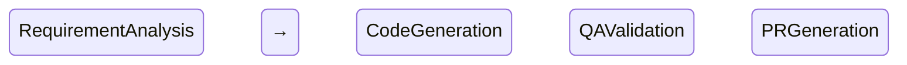

# README.md - Summary of Changes

## ✅ What Was Created

A comprehensive, professional README.md with **Mermaid diagrams** for the Jira Agentic Development System.

### 📊 File Statistics
- **Size**: 27.5 KB
- **Sections**: 15+ major sections
- **Diagrams**: 5 Mermaid diagrams
- **Code Examples**: 20+ snippets

---

## 🎨 Mermaid Diagrams Included

### 1. **High-Level Architecture Diagram**
```mermaid
graph TB
    External Systems → Frontend → API → Agents → Orchestration → Data → LLM
```
Shows the complete system architecture with all layers and their interactions.

### 2. **Complete Agent Workflow (Sequence Diagram)**
```mermaid
sequenceDiagram
    User → API → LangGraph → Agents → Jira/VectorDB/LLM
```
Illustrates the step-by-step execution flow through all agents with retry logic.

### 3. **LangGraph State Machine**

Shows the state transitions and conditional paths in the workflow.

### 4. **Data Flow Architecture**
```mermaid
flowchart LR
    Input → Processing → Agents → Context → Output
```
Visualizes how data flows through the system from ticket to PR.

### 5. **Agent Communication Pattern**
```mermaid
graph TD
    Requirement Analyst → Developer → QA → PR Generator
```
Details the internal workflow of each agent and their communication.

### 6. **Test Suite Overview**
```mermaid
graph LR
    Test Suite → Unit/Integration/E2E/System Tests
```
Shows the testing architecture and coverage.

---

## 📋 Major Sections

1. **Overview** - What it does and why it matters
2. **Key Features** - Multi-agent, Jira integration, RAG, monitoring
3. **System Architecture** - High-level architecture diagram
4. **Workflow Diagrams** - 5 detailed Mermaid diagrams
5. **Quick Start** - Step-by-step setup guide
6. **Project Structure** - Complete directory tree
7. **API Reference** - All endpoints with examples
8. **Testing** - Test suite overview and commands
9. **Configuration** - Environment variables and settings
10. **Troubleshooting** - Common issues and solutions
11. **Performance Metrics** - Execution times and resource usage
12. **Use Cases** - Real-world examples
13. **Deployment** - Docker and Docker Compose
14. **Documentation** - Links to all docs
15. **Contributing** - Development workflow
16. **Roadmap** - Future plans

---

## 🎯 Key Improvements

### Visual Enhancements
- ✅ 5 Mermaid diagrams for visual understanding
- ✅ Badges for Python, FastAPI, LangGraph
- ✅ Color-coded diagram nodes
- ✅ Emoji icons for better readability

### Content Enhancements
- ✅ Comprehensive API reference with examples
- ✅ Detailed troubleshooting section
- ✅ Performance metrics table
- ✅ Multiple use case examples
- ✅ Docker deployment instructions
- ✅ CI/CD integration example
- ✅ Test coverage table
- ✅ Contributing guidelines

### Structure Improvements
- ✅ Table of contents with links
- ✅ Logical section organization
- ✅ Code examples for all features
- ✅ Quick reference commands
- ✅ Links to additional documentation

---

## 🔍 Diagram Descriptions

### 1. High-Level Architecture
**Purpose**: Shows the complete system from external systems to LLM layer  
**Layers**: 7 distinct layers (External, Frontend, API, Agent, Orchestration, Data, LLM)  
**Connections**: Shows data flow and dependencies  
**Color Coding**: Different colors for different system types

### 2. Complete Agent Workflow
**Purpose**: Sequence diagram showing step-by-step execution  
**Participants**: User, API, LangGraph, 4 Agents, Jira, VectorDB, LLM  
**Stages**: 4 color-coded stages (Requirement, Code, QA, PR)  
**Retry Logic**: Shows QA failure and retry path

### 3. LangGraph State Machine
**Purpose**: State transitions in the workflow  
**States**: 5 states (4 stages + Error)  
**Transitions**: Success and failure paths  
**Notes**: Detailed description of each state's responsibilities

### 4. Data Flow Architecture
**Purpose**: How data moves through the system  
**Subgraphs**: Input, Processing, Agents, Context, Output  
**Flow**: Clear directional flow from ticket to PR  
**Color Coding**: Different colors for each agent

### 5. Agent Communication Pattern
**Purpose**: Internal workflow of each agent  
**Detail Level**: Shows 4-5 steps per agent  
**Decision Points**: QA agent has conditional logic  
**Connections**: Shows handoff between agents

---

## 📚 How to Use the README

### For New Users
1. Start with **Overview** to understand what the system does
2. Check **System Architecture** diagram for high-level understanding
3. Follow **Quick Start** for setup
4. Review **Workflow Diagrams** to understand execution flow

### For Developers
1. Review **Project Structure** for codebase organization
2. Study **Workflow Diagrams** for implementation details
3. Check **API Reference** for endpoint usage
4. Follow **Contributing** guidelines for development

### For DevOps
1. Check **Configuration** for environment setup
2. Review **Deployment** section for Docker setup
3. Study **Performance Metrics** for resource planning
4. Use **Troubleshooting** for common issues

---

## 🎨 Viewing Mermaid Diagrams

### On GitHub
Mermaid diagrams render automatically on GitHub README pages.

### In VS Code
Install the "Markdown Preview Mermaid Support" extension:
```bash
code --install-extension bierner.markdown-mermaid
```

### Online Viewers
- https://mermaid.live/
- https://mermaid-js.github.io/mermaid-live-editor/

### Export as Images
Use Mermaid CLI to export diagrams:
```bash
npm install -g @mermaid-js/mermaid-cli
mmdc -i README.md -o diagrams/
```

---

## ✨ Best Practices Used

### Documentation
- ✅ Clear, concise language
- ✅ Visual aids (diagrams)
- ✅ Code examples for every feature
- ✅ Troubleshooting section
- ✅ Links to additional resources

### Structure
- ✅ Logical flow (overview → setup → usage)
- ✅ Table of contents for navigation
- ✅ Consistent formatting
- ✅ Proper heading hierarchy
- ✅ Emoji for visual scanning

### Technical
- ✅ Accurate code examples
- ✅ Complete API reference
- ✅ Performance metrics
- ✅ Deployment instructions
- ✅ Testing guidelines

---

## 🚀 Next Steps

1. **Review the README** in GitHub or VS Code with Mermaid support
2. **Test the diagrams** render correctly
3. **Update links** to match your repository
4. **Add screenshots** of the dashboard (optional)
5. **Customize** sections for your specific needs

---

## 📝 Maintenance

### Keep Updated
- Update version badges when releasing
- Add new diagrams for new features
- Update performance metrics periodically
- Keep troubleshooting section current
- Update roadmap as features complete

### Regular Reviews
- Monthly: Check all links work
- Quarterly: Update examples and screenshots
- Per release: Update version numbers and features
- As needed: Add new troubleshooting items

---

**Created**: May 18, 2026  
**Format**: Markdown with Mermaid diagrams  
**Size**: 27.5 KB  
**Diagrams**: 5 Mermaid diagrams  
**Status**: ✅ Complete and ready to use
